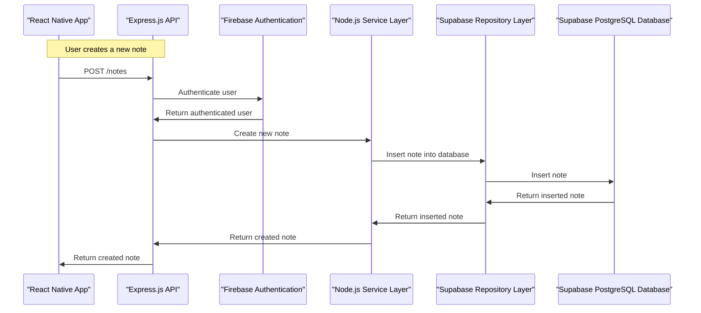
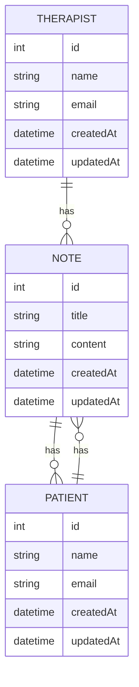

# TherapyNote AI
### MVP Architecture Document
> **Team:** talha ? **Duration:** 12 weeks ? **Stack:** React Native, TypeScript, Expo, Firebase, Supabase

---

## 1. Executive Summary
TherapyNote AI is a mobile application designed to streamline therapy note-taking with AI-powered tools. The primary problem it solves is the time-consuming and inefficient note-taking process that therapists face, resulting in decreased productivity and increased burnout. By utilizing AI-driven note summarization, personalized note organization, and real-time note analysis, TherapyNote AI delivers value to therapists by providing accurate and comprehensive notes. The end-user experience involves creating and managing notes, which are then analyzed and summarized by the AI engine, providing personalized recommendations for improvement.

The application's core features are designed to work seamlessly together, ensuring a smooth user experience. The AI engine is integrated as a first-class feature, utilizing a custom prompt template to generate accurate summaries. The application's data model is designed to store and manage notes, patients, and therapists, ensuring a comprehensive and secure data storage solution.

TherapyNote AI is built on top of a robust tech stack, including React Native, TypeScript, Expo, Firebase, and Supabase. This stack provides a solid foundation for the application's development, ensuring a scalable and maintainable solution. The application's architecture is designed to be modular, with each component communicating with others through well-defined APIs.

## 2. System Architecture Overview

### 2.1 High-Level Architecture Diagram
The high-level architecture of TherapyNote AI consists of the following layers:
```
                              +---------------+
                              |  Client (React  |
                              |  Native, Expo)  |
                              +---------------+
                                       |
                                       |
                                       v
                              +---------------+
                              | API Layer (Express|
                              | .js, TypeScript)  |
                              +---------------+
                                       |
                                       |
                                       v
                              +---------------+
                              |  Middleware (Firebase|
                              |  Authentication)    |
                              +---------------+
                                       |
                                       |
                                       v
                              +---------------+
                              | Service Layer (Node.js,|
                              |  TypeScript)        |
                              +---------------+
                                       |
                                       |
                                       v
                              +---------------+
                              | Repository Layer (Supabase|
                              |  PostgreSQL)      |
                              +---------------+
                                       |
                                       |
                                       v
                              +---------------+
                              |  Database (Supabase |
                              |  PostgreSQL)      |
                              +---------------+
```

### 2.2 Request Flow Diagram (Mermaid)


### 2.3 Architecture Pattern
The architecture pattern used in TherapyNote AI is a layered architecture, with each layer communicating with others through well-defined APIs. This pattern is suitable for the team size and timeline, as it allows for modular development and easy maintenance.

### 2.4 Component Responsibilities
The Client component is responsible for rendering the user interface and handling user input. It does not own the data storage or business logic, which is handled by the API Layer. The API Layer is responsible for handling incoming requests and sending responses. It communicates with the Middleware component for authentication and the Service Layer for business logic.

The Service Layer is responsible for encapsulating the business logic of the application. It communicates with the Repository Layer for data storage and retrieval. The Repository Layer is responsible for managing the data storage and retrieval, using the Database entity.

## 3. Tech Stack & Justification

| Layer | Technology | Why chosen |
|-------|-----------|------------|
| Client | React Native | Chosen for its ability to build cross-platform mobile applications with a native user experience. |
| API Layer | Express.js | Chosen for its lightweight and flexible framework, allowing for easy development and maintenance. |
| Middleware | Firebase Authentication | Chosen for its robust and scalable authentication solution, providing a secure and easy-to-use authentication system. |
| Service Layer | Node.js | Chosen for its ability to handle high-traffic and high-performance applications, providing a scalable and maintainable solution. |
| Repository Layer | Supabase | Chosen for its ability to provide a scalable and secure data storage solution, with a simple and intuitive API. |
| Database | Supabase PostgreSQL | Chosen for its ability to provide a scalable and secure data storage solution, with a robust and feature-rich database management system. |

## 4. Database Design

### 4.1 Entity-Relationship Diagram


### 4.2 Relationship & Association Details
The business rule that drives the relationship between a Note and a Patient is that a patient can have multiple notes, and a note is associated with one patient. The cardinality is one-to-many, and it is enforced at the database level. The join strategy used is a foreign key constraint, where the patient_id field in the notes table references the id field in the patients table.

The business rule that drives the relationship between a Note and a Therapist is that a therapist can have multiple notes, and a note is associated with one therapist. The cardinality is one-to-many, and it is enforced at the database level. The join strategy used is a foreign key constraint, where the therapist_id field in the notes table references the id field in the therapists table.

### 4.3 Schema Definitions (Code)
```typescript
import { Entity, Column, PrimaryGeneratedColumn, OneToMany, ManyToOne } from 'typeorm';

@Entity()
export class Note {
  @PrimaryGeneratedColumn()
  id: number;

  @Column()
  title: string;

  @Column()
  content: string;

  @Column()
  createdAt: Date;

  @Column()
  updatedAt: Date;

  @ManyToOne(() => Patient, (patient) => patient.notes)
  patient: Patient;

  @ManyToOne(() => Therapist, (therapist) => therapist.notes)
  therapist: Therapist;
}

@Entity()
export class Patient {
  @PrimaryGeneratedColumn()
  id: number;

  @Column()
  name: string;

  @Column()
  email: string;

  @Column()
  createdAt: Date;

  @Column()
  updatedAt: Date;

  @OneToMany(() => Note, (note) => note.patient)
  notes: Note[];
}

@Entity()
export class Therapist {
  @PrimaryGeneratedColumn()
  id: number;

  @Column()
  name: string;

  @Column()
  email: string;

  @Column()
  createdAt: Date;

  @Column()
  updatedAt: Date;

  @OneToMany(() => Note, (note) => note.therapist)
  notes: Note[];
}
```

### 4.4 Indexing Strategy
The indexing strategy used in the database is to create indexes on the fields that are used in the WHERE and JOIN clauses of the queries. For example, an index is created on the patient_id field in the notes table to improve the performance of the query that retrieves all notes for a patient.

### 4.5 Data Flow Between Entities
The data flow between entities in the system is as follows:

1. A patient is created, and their details are stored in the patients table.
2. A therapist is created, and their details are stored in the therapists table.
3. A note is created, and its details are stored in the notes table. The note is associated with a patient and a therapist using foreign key constraints.
4. When a patient is retrieved, all their associated notes are retrieved using a JOIN clause.
5. When a therapist is retrieved, all their associated notes are retrieved using a JOIN clause.

## 5. API Design

### 5.1 Authentication & Authorization
The authentication mechanism used in the API is JSON Web Tokens (JWT). When a user logs in, a JWT token is generated and returned to the client. The client then includes this token in the Authorization header of all subsequent requests. The API verifies the token on each request and authenticates the user accordingly.

### 5.2 REST Endpoints
The API endpoints are as follows:

| Method | Path | Auth | Request Body | Response | Description |
|--------|------|------|--------------|----------|-------------|
| POST | /notes | Required | Note object | Created note | Create a new note |
| GET | /notes | Required |  | Array of notes | Retrieve all notes for a patient |
| GET | /notes/{id} | Required |  | Note object | Retrieve a note by ID |
| PUT | /notes/{id} | Required | Note object | Updated note | Update a note |
| DELETE | /notes/{id} | Required |  |  | Delete a note |

### 5.3 Error Handling
The API uses a standard error response format, which includes an error code, a message, and any additional details. The error codes used are:

* 401: Unauthorized
* 403: Forbidden
* 404: Not Found
* 500: Internal Server Error

## 6. Frontend Architecture

### 6.1 Folder Structure
The folder structure of the frontend code is as follows:
```
src/
components/
NoteList.tsx
NoteForm.tsx
...
containers/
App.tsx
...
models/
Note.ts
Patient.ts
Therapist.ts
...
services/
api.ts
...
utils/
auth.ts
...
index.tsx
```

### 6.2 State Management
The application uses Redux for state management. The state is divided into several slices, each managing a specific part of the application's state.

### 6.3 Key Pages & Components
The key pages and components of the application are:

* NoteList: a list of all notes for a patient
* NoteForm: a form for creating or editing a note
* App: the main application component

## 7. Core Feature Implementation

### 7.1 AI-Driven Note Summarization

#### User Flow
The user creates a new note and submits it. The application then sends a request to the API to summarize the note.

#### Frontend
The NoteForm component handles the note submission and sends a request to the API to summarize the note.

#### API Call
The API endpoint for summarizing a note is as follows:
```json
POST /notes/summarize
{
  "noteId": 1
}
```
The API returns a summarized version of the note.

#### Backend Logic
The backend logic for summarizing a note involves calling a machine learning model to generate a summary of the note. The model is trained on a dataset of notes and their corresponding summaries.

#### Database
The database is not involved in this feature.

#### AI Integration
The AI integration involves calling a machine learning model to generate a summary of the note. The model is trained on a dataset of notes and their corresponding summaries.

#### Code Snippet
```typescript
import { api } from '../services/api';

const summarizeNote = async (noteId: number) => {
  const response = await api.post('/notes/summarize', { noteId });
  return response.data;
};
```

### 7.2 Personalized Note Organization

#### User Flow
The user creates a new note and submits it. The application then organizes the note into a category based on its content.

#### Frontend
The NoteForm component handles the note submission and sends a request to the API to organize the note.

#### API Call
The API endpoint for organizing a note is as follows:
```json
POST /notes/organize
{
  "noteId": 1
}
```
The API returns the organized note.

#### Backend Logic
The backend logic for organizing a note involves calling a machine learning model to generate a category for the note. The model is trained on a dataset of notes and their corresponding categories.

#### Database
The database is involved in this feature, as it stores the notes and their corresponding categories.

#### AI Integration
The AI integration involves calling a machine learning model to generate a category for the note. The model is trained on a dataset of notes and their corresponding categories.

#### Code Snippet
```typescript
import { api } from '../services/api';

const organizeNote = async (noteId: number) => {
  const response = await api.post('/notes/organize', { noteId });
  return response.data;
};
```

## 8. Security Considerations

The application uses several security measures to protect user data, including:

* Authentication and authorization using JSON Web Tokens (JWT)
* Encryption of data in transit using SSL/TLS
* Validation and sanitization of user input to prevent SQL injection and cross-site scripting (XSS) attacks
* Regular security audits and penetration testing to identify vulnerabilities

## 9. MVP Scope Definition

### 9.1 In Scope (MVP)
The following features are in scope for the MVP:

* User authentication and authorization
* Note creation and editing
* Note summarization using AI
* Note organization using AI
* Display of notes in a list

### 9.2 Out of Scope (Post-MVP)
The following features are out of scope for the MVP:

* Integration with external APIs (e.g. calendar, email)
* Advanced search functionality
* Customizable note templates
* Collaboration features (e.g. multi-user editing)

### 9.3 Success Criteria
The following criteria define the success of the MVP:

* The application is fully functional and stable
* The AI-powered note summarization and organization features are accurate and useful
* The application is secure and protects user data
* The application is easy to use and navigate

## 10. Week-by-Week Implementation Plan

### Week 1: Project Setup and Planning
* Focus: Set up the project structure and plan the implementation
* Deliverable: Project structure and implementation plan
* Done-when: The project structure is set up, and the implementation plan is complete

### Week 2-3: User Authentication and Authorization
* Focus: Implement user authentication and authorization using JWT
* Deliverable: Functional user authentication and authorization
* Done-when: The user authentication and authorization are fully functional

### Week 4-5: Note Creation and Editing
* Focus: Implement note creation and editing
* Deliverable: Functional note creation and editing
* Done-when: The note creation and editing features are fully functional

### Week 6-7: AI-Powered Note Summarization
* Focus: Implement AI-powered note summarization using a machine learning model
* Deliverable: Functional AI-powered note summarization
* Done-when: The AI-powered note summarization feature is fully functional

### Week 8-9: AI-Powered Note Organization
* Focus: Implement AI-powered note organization using a machine learning model
* Deliverable: Functional AI-powered note organization
* Done-when: The AI-powered note organization feature is fully functional

### Week 10-12: Testing and Deployment
* Focus: Test the application and deploy it to production
* Deliverable: Fully functional and deployed application
* Done-when: The application is fully functional and deployed to production

## 11. Testing Strategy

| Type | Tool | What is tested | Target coverage |
|------|------|---------------|-----------------|
| Unit | Jest | Individual components and functions | 80% |
| Integration | Cypress | API endpoints and user flows | 90% |
| End-to-end | Cypress | Entire application | 95% |

## 12. Deployment & DevOps

### 12.1 Local Development Setup
To set up the project locally, run the following commands:
```bash
git clone https://github.com/talha/therapynote-ai.git
cd therapynote-ai
npm install
npm start
```

### 12.2 Environment Variables
The following environment variables are required:
* `REACT_APP_API_URL`: The URL of the API
* `REACT_APP_AUTH_TOKEN`: The authentication token

### 12.3 Production Deployment
The application is deployed to production using Vercel. The deployment process involves building the application and deploying it to Vercel.

## 13. Risk Register

| Risk | Likelihood | Impact | Mitigation |
|------|-----------|--------|-----------|
| Difficulty in implementing AI-powered features | High | High | Research and plan carefully, use existing libraries and frameworks |
| Security vulnerabilities | Medium | High | Implement security measures, use secure protocols and libraries |
| Delays in development | Medium | Medium | Plan carefully, prioritize features, use agile development methodologies |
| Limited resources | Low | Medium | Prioritize features, use open-source libraries and frameworks |
| Changes in requirements | Low | Low | Be flexible, use agile development methodologies |